# [MIA] My IDE Actions
Since release 2502, there have been IDE Actions in the ABAP Environment. This makes it possible to write your own actions in the ABAP Development Tools. In this repository you will find a collection of different actions.

## Installation

Currently, IDE Actions cannot be saved in Git, so the IDE Actions must first be created after installation. Here you will find all steps to create them.

### Create new class

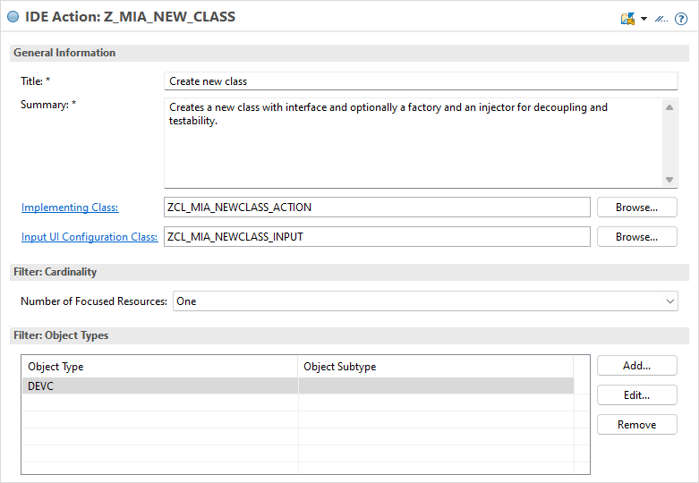

| Object                       | Value                                                                                                       |
|------------------------------|-------------------------------------------------------------------------------------------------------------|
| Package                      | Z_MIA_ACTIONS                                                                                               |
| IDE Action Name              | Z_MIA_NEW_CLASS                                                                                             |
| Title                        | MIA: Create new class                                                                                       |
| Summary                      | Creates a new class with interface and optionally a factory and an injector for decoupling and testability. |
| Implementing Class           | ZCL_MIA_NEWCLASS_ACTION                                                                                     |
| Input UI Configuration Class | ZCL_MIA_NEWCLASS_INPUT                                                                                      |
| Number of Focused Resources  | One                                                                                                         |
| Object Type (Filter)         | DEVC                                                                                                        |

### SELECT Converter

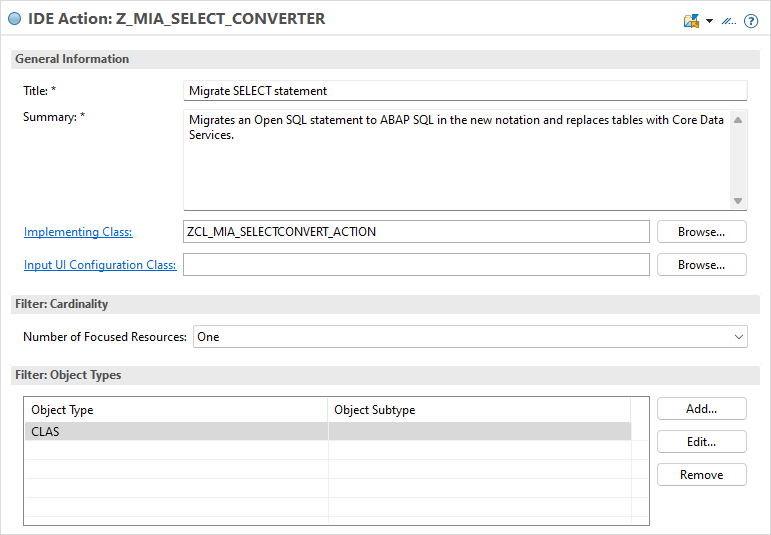

| Object                       | Value                                                                                                       |
|------------------------------|-------------------------------------------------------------------------------------------------------------|
| Package                      | Z_MIA_ACTIONS                                                                                               |
| IDE Action Name              | Z_MIA_SELECT_CONVERTER                                                                                      |
| Title                        | MIA: Migrate SELECT statement                                                                               |
| Summary                      | Migrates an Open SQL statement to ABAP SQL in the new notation and replaces tables with Core Data Services. |
| Implementing Class           | ZCL_MIA_SELECTCONVERT_ACTION                                                                                |
| Input UI Configuration Class |                                                                                                             |
| Number of Focused Resources  | One                                                                                                         |
| Object Type (Filter)         | CLAS                                                                                                        |

### Code Snippets

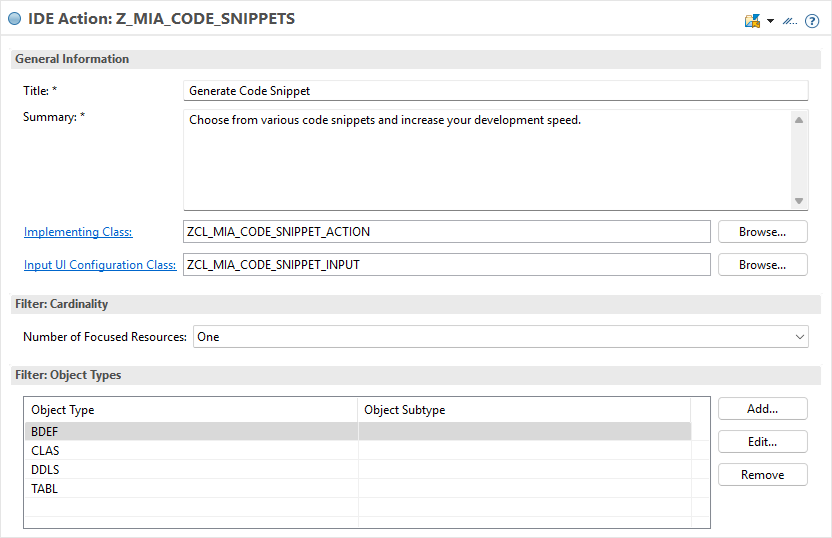

| Object                       | Value                                                                                                       |
|------------------------------|-------------------------------------------------------------------------------------------------------------|
| Package                      | Z_MIA_ACTIONS                                                                                               |
| IDE Action Name              | Z_MIA_CODE_SNIPPETS                                                                                         |
| Title                        | MIA: Generate Code Snippet                                                                                  |
| Summary                      | Choose from various code snippets and increase your development speed.                                      |
| Implementing Class           | ZCL_MIA_CODE_SNIPPET_ACTION                                                                                 |
| Input UI Configuration Class | ZCL_MIA_CODE_SNIPPET_INPUT                                                                                  |
| Number of Focused Resources  | One                                                                                                         |
| Object Type (Filter)         | BDEF; CLAS; DDLS; TABL                                                                                      |

### Scope Launchpad

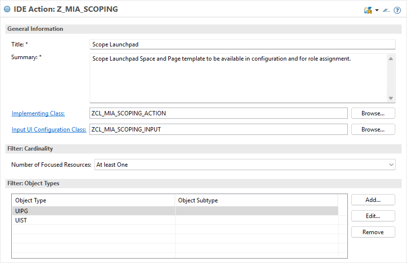

| Object                       | Value                                                                                                       |
|------------------------------|-------------------------------------------------------------------------------------------------------------|
| Package                      | Z_MIA_ACTIONS                                                                                               |
| IDE Action Name              | Z_MIA_SCOPING                                                                                               |
| Title                        | MIA: Scope Launchpad                                                                                        |
| Summary                      | Scope Launchpad Space and Page template to be available in configuration and for role assignment.           |
| Implementing Class           | ZCL_MIA_SCOPING_ACTION                                                                                      |
| Input UI Configuration Class | ZCL_MIA_SCOPING_INPUT                                                                                       |
| Number of Focused Resources  | At least One                                                                                                |
| Object Type (Filter)         | UIPG; UIST                                                                                                  |

### Consumption Model fields

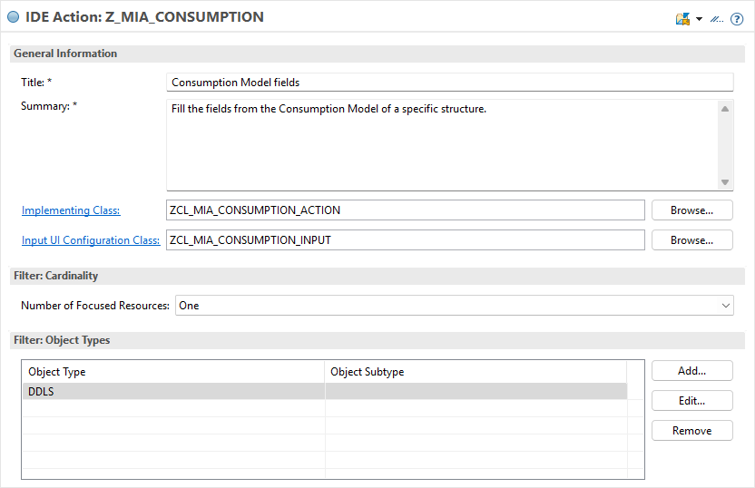

| Object                       | Value                                                                                                       |
|------------------------------|-------------------------------------------------------------------------------------------------------------|
| Package                      | Z_MIA_ACTIONS                                                                                               |
| IDE Action Name              | Z_MIA_CONSUMPTION                                                                                           |
| Title                        | MIA: Consumption Model fields                                                                               |
| Summary                      | Fill the fields from the Consumption Model of a specific structure.                                         |
| Implementing Class           | ZCL_MIA_CONSUMPTION_ACTION                                                                                  |
| Input UI Configuration Class | ZCL_MIA_CONSUMPTION_INPUT                                                                                   |
| Number of Focused Resources  | One                                                                                                         |
| Object Type (Filter)         | DDLS                                                                                                        |

### RAP Analyzer

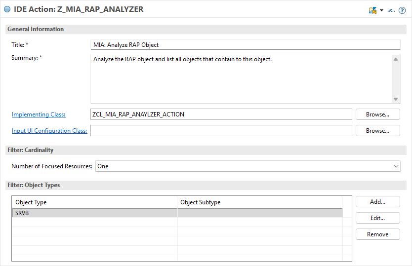

| Object                       | Value                                                                                                       |
|------------------------------|-------------------------------------------------------------------------------------------------------------|
| Package                      | Z_MIA_ACTIONS                                                                                               |
| IDE Action Name              | Z_MIA_RAP_ANALYZER                                                                                          |
| Title                        | MIA: Analyze RAP Object                                                                                     |
| Summary                      | Analyze the RAP object and list all objects that contain to this object.                                    |
| Implementing Class           | ZCL_MIA_RAP_ANAYLZER_ACTION                                                                                 |
| Input UI Configuration Class |                                                                                                             |
| Number of Focused Resources  | One                                                                                                         |
| Object Type (Filter)         | SRVB                                                                                                        |

### RAP Extension Assistant

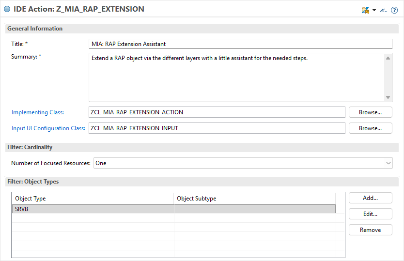

| Object                       | Value                                                                                                       |
|------------------------------|-------------------------------------------------------------------------------------------------------------|
| Package                      | Z_MIA_ACTIONS                                                                                               |
| IDE Action Name              | Z_MIA_RAP_EXTENSION                                                                                         |
| Title                        | MIA: RAP Extension Assistant                                                                                |
| Summary                      | Extend a RAP object via the different layers with a little assistant for the needed steps.                  |
| Implementing Class           | ZCL_MIA_RAP_EXTENSION_ACTION                                                                                |
| Input UI Configuration Class | ZCL_MIA_RAP_EXTENSION_INPUT                                                                                 |
| Number of Focused Resources  | One                                                                                                         |
| Object Type (Filter)         | SRVB                                                                                                        |

### Metadata Wizard


| Object                       | Value                                                                                                       |
|------------------------------|-------------------------------------------------------------------------------------------------------------|
| Package                      | Z_MIA_METADATA                                                                                              |
| IDE Action Name              | Z_MIA_RAP_EXTENSION                                                                                         |
| Title                        | MIA: Metadata Wizard                                                                                        |
| Summary                      | Generates the Metadata Extension configuration for an entity.                                               |
| Implementing Class           | ZCL_MIA_METADATA_ACTION                                                                                     |
| Input UI Configuration Class | ZCL_MIA_METADATA_INPUT                                                                                      |
| Number of Focused Resources  | One                                                                                                         |
| Object Type (Filter)         | DDLX/EX                                                                                                     |

## Features

Currently the following actions and features are included.

### Create class

Creates a class and optionally the interface, factory and injector. Activate the action on a focused package, the information of the package name and prefix are generated. If the package is assigned to a transport, this transport is also proposed.

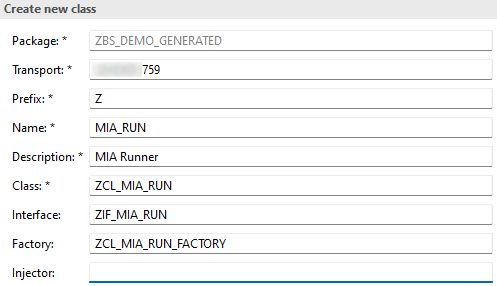

Interface , Factory and Injector are not mandatory, if you delete the string, the objects and dependencies are not created.


### SELECT Converter

Converts a SELECT statement from classic Open SQL to ABAP SQL and exchanges the table access and fields through Core Data Services if they are released for ABAP Cloud. The basis is the SwH tool "[ABAP Select Converter](https://software-heroes.com/en/abap-select-converter)".

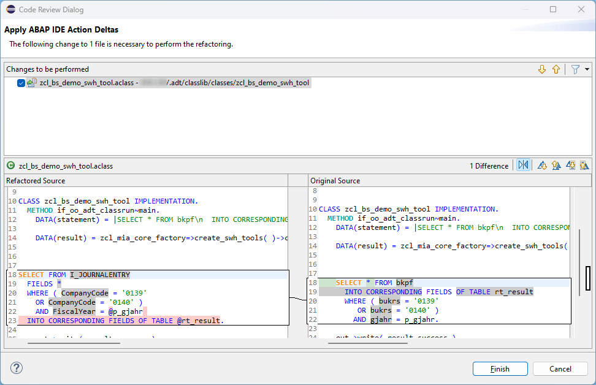

The SELECT must be marked, then the statement can be replaced.

### Code Snippets

It takes various code snippets from the [GitHub](https://github.com/Xexer/abap-code-snippets) repository and allows you to parameterize and insert them into the source code. Currently, various objects are supported.

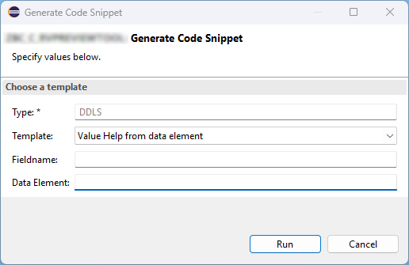

### Scope Launchpad

Scope the Launchpad Content as Spaces and Pages that have been created with the ABAP Development Tools. More informations about scoping in this [article](https://software-heroes.com/en/blog/btp-pages-and-spaces-adt).

### Consumption Model fields

It takes a consumption model class that inherits from the superclass /IWBEP/CL_V4_ABS_PM_MODEL_PROV and provides the option to select the appropriate structure from the class. 

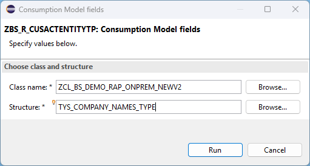

So the type definition in the class is converted.

```ABAP
TYPES:
  "! <p class="shorttext synchronized" lang="en">CompanyNamesType</p>
  BEGIN OF tys_company_names_type,
    "! <em>Key property</em> CompanyName
    company_name        TYPE c LENGTH 60,
    "! Branch
    branch              TYPE c LENGTH 50,
    "! CompanyDescription
    company_description TYPE c LENGTH 255,
  END OF tys_company_names_type.
```

Finally, the complete field mapping is written to the custom entity to establish integration.

```ABAP 
@EndUserText.label: 'CompanyName'
key company_name : abap.char(60);
@EndUserText.label: 'Branch'
branch : abap.char(50);
@EndUserText.label: 'CompanyDescription'
company_description : abap.char(255);
```

### RAP Analyzer

Analyzes the service and the RAP pattern used, and finally displays an overview of the most important objects and hierarchies. This should enable easier analysis and navigation within the RAP object.

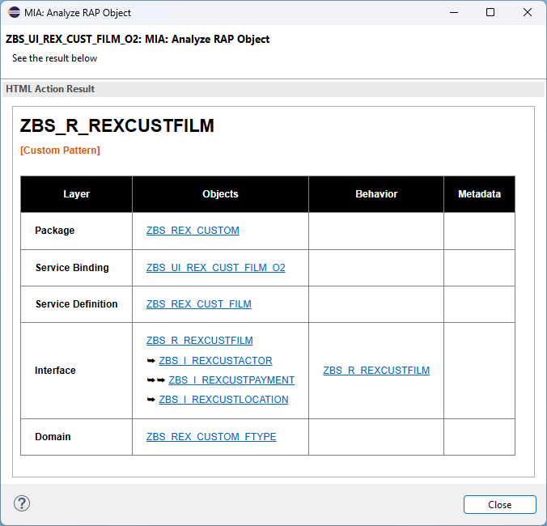

### RAP Extension Assistant

Returns some suggested extension scenarios to help extend the RAP object. The solution is suggested step by step, allowing developers to implement it with code examples.

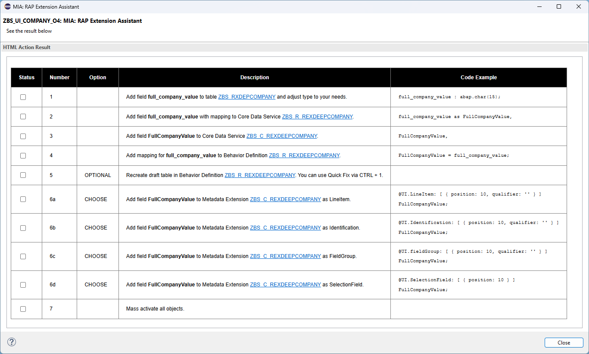

### Metadata Wizard

Creates UI annotations for the fields in the current metadata extension. Various aspects can be customized before the field annotations are generated. The fields and their associations are taken into account, and various values ​​can be maintained.

## Influence on System

### Security

Here you will find a list of the IDE actions that contact services outside the system when used and in detail which data is transferred.

| IDE Actions      | Endpoint            | Data                     |
|------------------|---------------------|--------------------------|
| SELECT Converter | Software-Heroes API | -> Full SELECT Statement |
| Code Snippets    | GitHub Repository   | <- Code Templates        |

### Changeability

Here you can find information about whether IDE Actions make changes to the system and what is changed.

| IDE Actions              | Change                 |
|--------------------------|------------------------|
| Create new class         | Creates new objects    |
| SELECT Converter         | Change code            |
| Code Snippets            | Insert new code        |
| Scope Launchpad          | Change status of items |
| Consumption Model fields | Insert new code        |

## Public Material

- Software-Heroes: [ADT - My IDE Actions](https://software-heroes.com/en/blog/tools-adt-my-ide-actions-en)
- SAP Community: [[MIA] My IDE Actions](https://community.sap.com/t5/technology-blogs-by-members/mia-my-ide-actions/ba-p/14019000)
